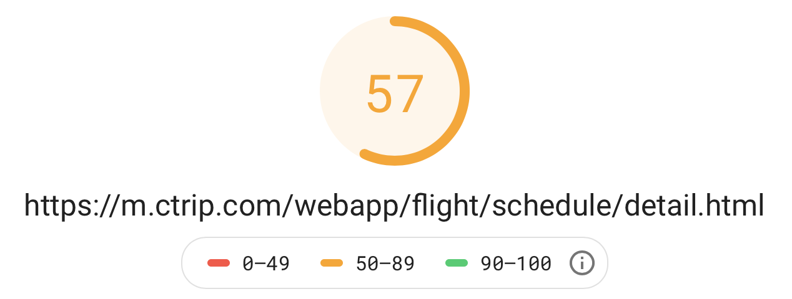
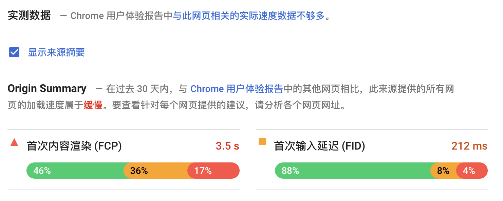
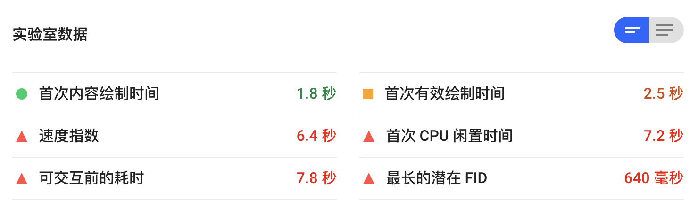
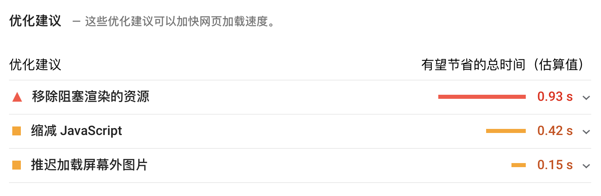
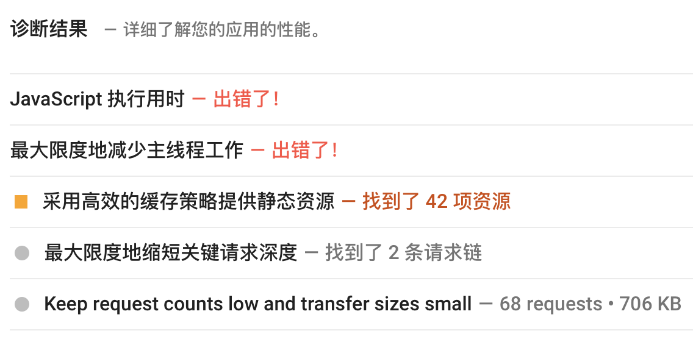
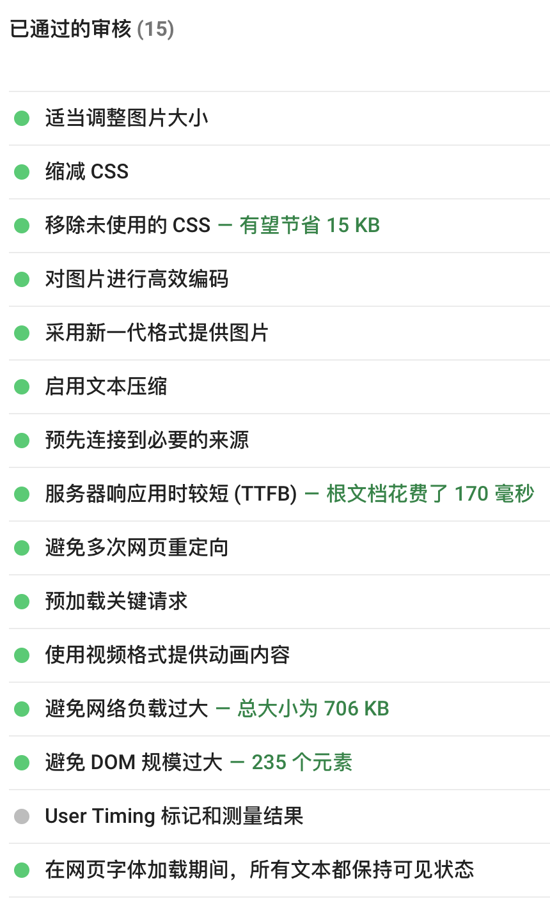
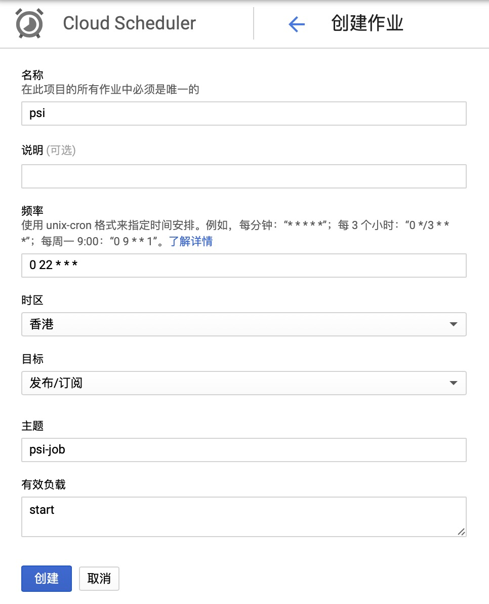
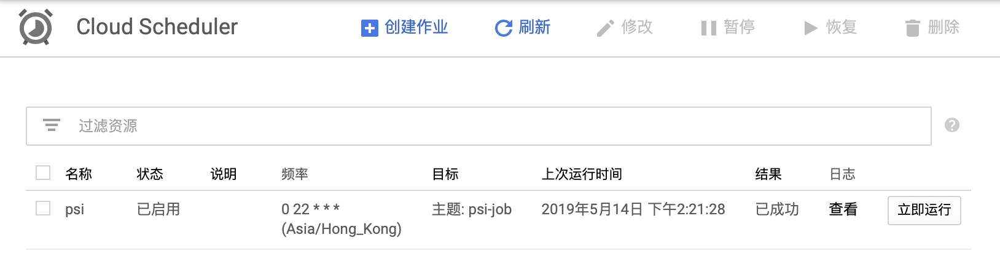
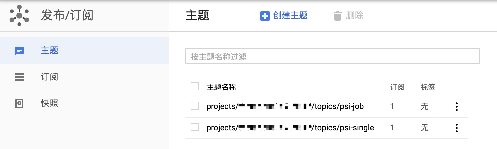

使用 Google Cloud Scheduler， Pub/Sub， Functions ， Storage 等云服务，搭建 PageSpeed Insights 前端网站网页的质量和性能 benchmark 定时审查系统。与 CI/CD 流程结合，定时大批量审查网站技术性能指标。

### 1. PageSpeed Insights

#### 1.1 简介

PageSpeed Insights 是 Google 提供的一款网页性能检测优化工具，能够针对移动设备和桌面设备生成网页的实际性能报告，并提供关于如何改进相应网页的建议。它采用 Google Lighthouse 提供的各种最佳实践作为测试基准，使用 Blink 渲染工具（即 Google Chrome 的渲染引擎），模拟移动设备和桌面设备，抓取目标网站网页，进行优化分析。  
以下简称PSI。  

#### 1.2 版本历史

版本 | 发布时间 | 功能更新
--|--|--
V5 | 2018年Q4 | 当前最新版本。2019.05.08更新使用 Lighthouse 5.0 作为其分析引擎。
V4 | 2018年1月 | 2019年Q3之前停用
V2 | 2015年1月| 已停用
V1 | 更早期 | 已停用

#### 1.3 分析报告组成

#### 1.3.1 综合速度得分

评分和等级：  

+ 快 90分以上
+ 中等 50-90分
+ 慢 50分以下

V5版本使用 Lighthouse 计算多项性能指标的综合加权得分。  
V4及之前版本结合 Chrome 用户体验报告数据库中的真实用户测速数据，计算评分和等级。主要参考以下两项指标。  

+ FCP （First Contentful Paint）首次内容绘制，用于衡量用户何时看到来自相应网页的可见响应。所用时间越短，留住用户的可能性就越大。
+ DCL 文档内容加载，用于衡量何时完成 HTML 文档的加载和解析。所用时间越短，跳出率越低。

#### 1.3.2 实测数据

结合 Chrome 用户体验报告中的其他网页过去30天内的实测数据相比的得分。

#### 1.3.3 实验室数据

给出以下几项指标的耗时绝对值数据：  

+ First Contentful Paint 首次内容绘制时间
+ First Meaningful Paint 首次有效绘制时间
+ Speed Index 速度指数
+ First CPU Idle 首次 CPU 闲置时间
+ Time to Interactive 可交互前的耗时
+ Estimated Input Latency 最长的潜在FID

#### 1.3.4 关于如何加快网页加载速度的优化建议

#### 1.3.5 关于Web开发最佳实践的详细诊断建议。

#### 1.3.6 已通过的符合最佳实践的审查项

#### 1.4 实际案例

以携程机票H5航班动态首页的某线上版本为例，直观的查看分析报告：  
https://m.ctrip.com/webapp/flight/schedule/detail.html  













#### 1.5 使用方法

PSI API是Google RESTful APIs之一， 仅需一次 HTTP 请求 ，应答返回一个 JSON Ojbect。使用极其简便。  

#### HTTP Request

> GET https://www.googleapis.com/pagespeedonline/v5/runPagespeed

必选参数1个：  

+ `url`: 目标分析网页的链接

可选参数6个：

+ category：`accessibility`，`best-practices`，`performance`，`pwa`，`seo`。默认是`performance`。
+ locale：返回结果文本的本地化语言版本。目前支持40种。默认英语`en`。
+ strategy：`desktop` 针对桌面浏览器进行优化分析，`mobile` 针对移动设备浏览器进行优化分析。
+ utm_campaign：广告系列名称
+ utm_source：广告系列来源
+ fields： 定制 Response 内容字段。

#### HTTP Response

返回一个 JSON Object ，字段内容较多，此处省略，详见官网文档。

#### 最简单命令行调用

> curl https://www.googleapis.com/pagespeedonline/v5/runPagespeed?url=https://m.ctrip.com

### 2. Google Cloude Platform (GCP)

#### 2.1 系统流程图

#### 2.2 Cloud Scheduler

Cloud Scheduler 是 GCP 的一项全托管式企业级 cron 作业调度服务。支持 App Engine、Cloud Pub/Sub 和任意 HTTP 端点，允许作业触发 Compute Engine、Google Kubernetes Engine 和本地资源。  
使用 Google Cloud Console 创建Job。目标有3种：HTTP，Pub/Sub，App Engine HTTP。这里选择 Pub/Sub 。设置每天22:00自动触发。  



创建成功后查看部署状态，部署成功后可以直接“立即运行”，查看日志，确认运行正常。  



#### 2.3 Cloud Pub/Sub

Cloud Pub/Sub 是 GCP 的一项简单、可靠、可伸缩，可以用作数据流分析和事件驱动型计算系统的基础。  
这里创建两个主题，`psi-job` 用于 Cloude Scheduler Job 的事件数据中转，`psi-single` 用于 Cloud Functions 的并发 HTTP 请求的事件数据中转。  


### 2.4 Cloud Functions

实现并发大量网页的 PageSpeed Insights 检查，有多种方式。可以使用 Google App engine， Google Compute Engine。鉴于 PSI API 是上下文无关的简单 HTTP RESTful API，Cloud Functions Serverless 是最佳最简实现。  
Cloud Functions 是 GCP 的一项事件驱动型无服务器计算平台。通过构建多个分别专注于做好一件事的小型独立功能单元，再将这些功能单元组合成一个系统，实现快速开发和部署。支持在单个函数（而不是整个应用、容器或虚拟机）级构建和部署服务。

#### 2.4.1 编写 Function

目前支持以下几种方案：

语言 | JavaScript
--|--
运行时 | Node.js 6(已弃用)、8、10（测试版）
HTTP 框架 | Express
HTTP 函数 | Express Request & Response Context
后台函数 | (data, context, callback)
依赖项管理 | npm/yarn + package.json

语言 | Python
--|--
运行时 | 3.7.1
HTTP 框架 | Flask
HTTP 函数 | 入参：Flask Request Object。返回值：符合 Flask.make_response() 的任意对象。
后台函数 | (data, context)
依赖项管理 | pip + requirements.txt

语言 | Go
--|--
运行时 | Go 1.11
HTTP 框架 | http.HandlerFunc 标准接口
HTTP 函数 | request: *http.Request. response: http.ResponseWriter.
后台函数 | (ctx, Event)
依赖项管理 | go.mod/vendor

#### 2.4.2 部署 Function

目前支持以下几种方式：  

+ 从本地机器部署。`使用 gcloud 命令行工具。`
+ 通过源代码控制系统部署。`使用 Google Cloud Source Repositories ，通过 OAuth 关联源代码仓库（如 GitHub 或 Bitbucket）。`
+ 通过 GCP Console 部署。
  + 网页内嵌编辑器.`直接在线编写函数代码。`
  + 上传本地ZIP文件。`文件夹目录结构与上述依赖性管理的源码工程结构一致。`
  + 导入 Cloud Storage 中的 ZIP 文件。`同上。`
  + 引用 Google Cloud Source Repositories的源代码工程。
+ 通过CI/CD部署。`使用 Cloud Build 搭建持续集成和部署系统。`

#### 2.4.3 监控 Function

Google Stackdriver 提供了服务监控工具，包括 `Debugger，Monitoring，Trace，Logging, Error Reporting，Profiler`。

### 3. PSI Functions 实现

创建好一个 Scheduler Job 和两个 Pub/Sub 主题后，接下来实现两个对应的 Functions 。  

#### 3.1 psi-single function

psi-single() 负责针对具体单一 URL ，调用 PSI API 获取 JSON 结果的功能。  
Google APIs 支持多种调用方式。

**3.1.1 使用 `google api client` 。**  
通过 `Discovery API` ，获得已经封装好的 `Service` ，再调用具体接口。  

```Python
from googleapiclient.discovery import build

def run(url):
    pagespeedonline = build(
        serviceName = 'pagespeedonline',
        version = 'v5',
        developerKey = API_KEY
    )
    response = pagespeedonline.pagespeedapi().runpagespeed(url = url).execute()
    print(response)
    return 'OK'
```

**3.1.2 针对简单接口，直接调用 `HTTP RESTful API` 。**  

```Python
import requests
GAPI_PSI = "https://www.googleapis.com/pagespeedonline/v5/runPagespeed"

def run(url):
    try:
        payload = {"url": url,
                   "key": API_KEY
                   }
        with requests.Session() as session:
            response = session.get(url=GAPI_PSI, params=payload)
            print(response.status_code)
            print(response.json())
    except requests.RequestException as _e:
        print(_e)
    return 'OK'
```

**3.1.3 实现 Pub/Sub 主题的订阅**  
订阅消息 `event` 的格式详见官网文档，其中 data 属性是一段 `base64` 编码的 `ByteArray` ，承载了实际的数据内容。

```Python
import base64

def run_pubsub(event, context):
    pubsub_message = base64.urlsafe_b64decode(event['data']).decode('utf-8')
    return run(pubsub_message)
```

#### 3.2 psi-job function

psi-job() 由 Scheduler Job 触发，将所有需审查的 URL 以 Pub/Sub 事件形式，并行分发给 psi-single() 。

```Python
from google.cloud import pubsub_v1

def run(event, context):
    publisher = pubsub_v1.PublisherClient()
    topic = publisher.topic_path(PROJECT_ID, TOPIC_NAME)
    for url in URL_DICT:
        data = url.encode('utf-8')
        publisher.publish(topic, data)
    return 'OK'
```

#### 3.3 环境变量和依赖项

为了避免安全敏感信息泄漏，可以将关键信息写入 Functions 环境变量和本地环境变量（本地开发调试使用）。  
上述代码中 `API_KEY, PROJECT_ID` 等数据通过 `os.getenv()` 获取。  
Cloude Functions 已内置常用依赖库，详见官网文档。如需增加依赖项，配置各语言对应的工程文件。上述代码引用了两个依赖库。  

```Python
# requirements.txt
# Function dependencies
requests==2.21.0
google-cloud-pubsub==0.40.0
```

### 4. Storage

上述代码中的 `print()` 会写入 StackDriver 日志库，供后续过滤分析。鉴于每一个 URL 的审查结果是一个 JSON Object 字符串，可以进一步写入 BigTable ， 使用 BigQuery 进行查询分析，再进一步导入 Google Data Studio ， 进行可视化报表展示。  
这里使用 Cloud Storage 存储 JSON 字符串为单一文件。  

```Python
from urllib import parse
from google.cloud import storage
from google.cloud.storage import Blob

def save(url, report):
    '''Save to https://console.cloud.google.com/storage/browser/[bucket-id]/'''
    client = storage.Client()
    bucket = client.get_bucket("psi-report")
    blob = Blob(f"${parse.quote_plus(url)}.json", bucket)
    blob.upload_from_string(report, "application/json")
```

添加依赖项。

```Python
# requirements.txt
# Function dependencies
google-cloud-storage==1.15.0
```

### 5. 源代码

https://github.com/9468305/python-script/tree/master/PageSpeedInsights

### 6. 文档链接

1. PageSpeed Insights  
https://developers.google.com/speed/pagespeed/insights
2. Google Lighthouse  
https://developers.google.com/web/tools/lighthouse/
3. Google Cloud Scheduler  
https://cloud.google.com/scheduler/
4. Google Cloud Pub/Sub  
https://cloud.google.com/pubsub/
5. Google Cloud Functions  
https://cloud.google.com/functions/
6. Google Cloud Storage  
https://cloud.google.com/storage/
7. Google Cloud Build  
https://cloud.google.com/cloud-build/
8. Google Stackdriver  
https://cloud.google.com/stackdriver/
